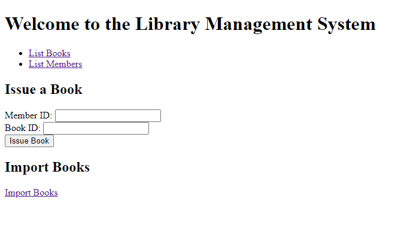
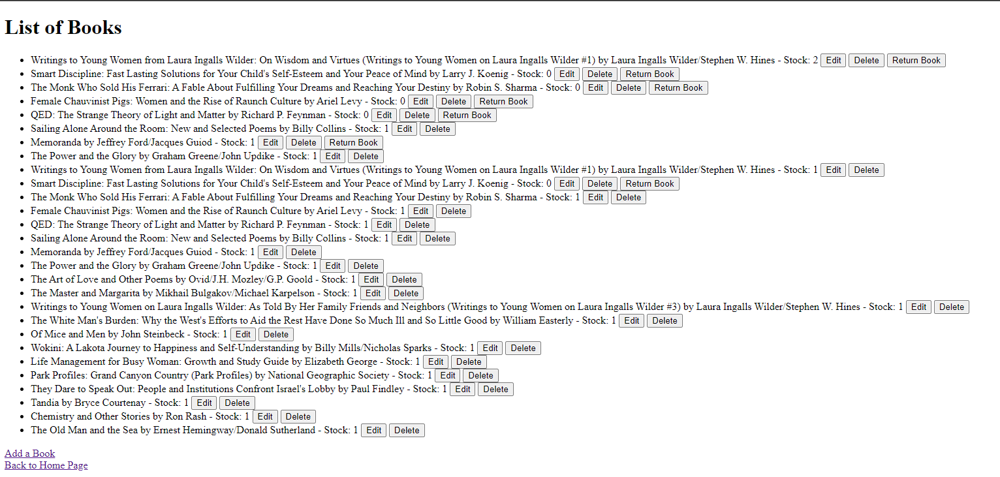
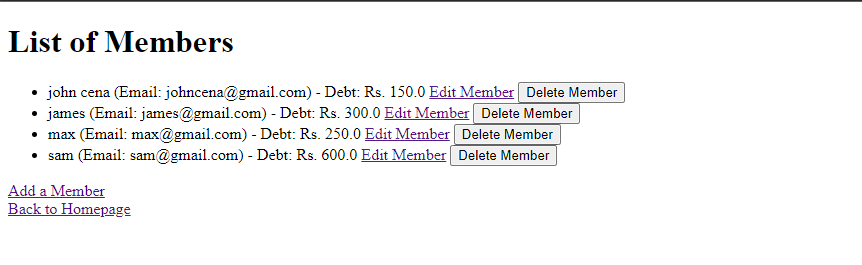
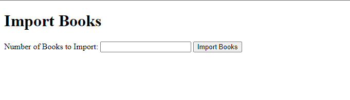

# Library Management System

The Library Management System is a Flask-based web application for managing books, members, and transactions in a library. It allows you to perform operations such as adding books, members, issuing and returning books, and tracking late fees for overdue books.


## Features

- Add, edit, and delete books from the library database.
- Add, edit, and delete members.
- Issue books to members.
- Return books and calculate late fees for overdue books.
- Import books from an FRAPPE API.
- View the list of books, members, and transactions.

## Getting Started

Follow these instructions to get the project up and running on your local machine.

### Prerequisites

- Python 3.x
- Flask
- SQLAlchemy
- SQLite (for the database)

### Installation

1. Clone the repository:

   ```bash
   git clone https://github.com/khanimran17/library-management.git
   
## Screenshots






